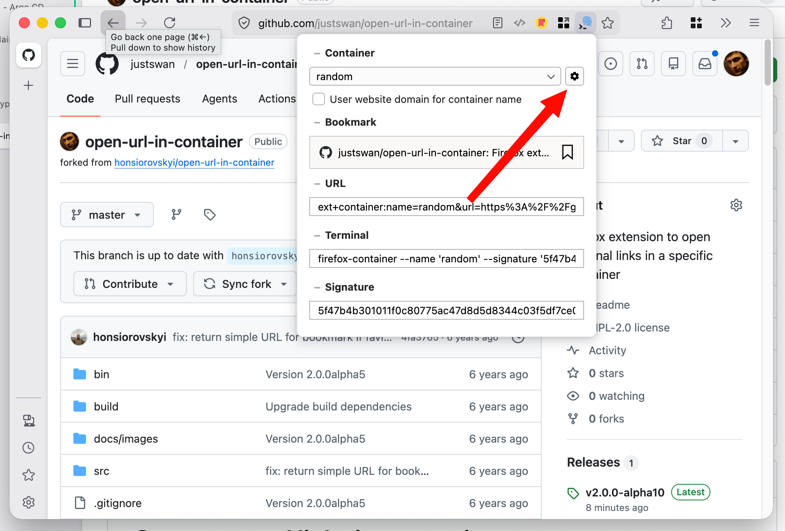
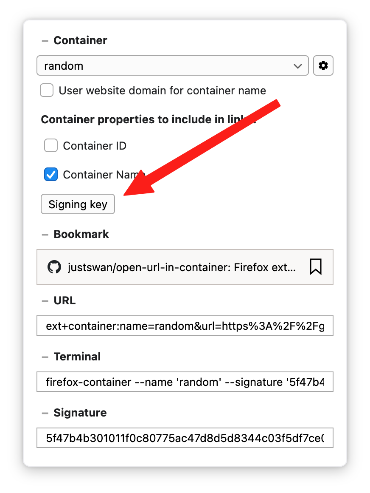
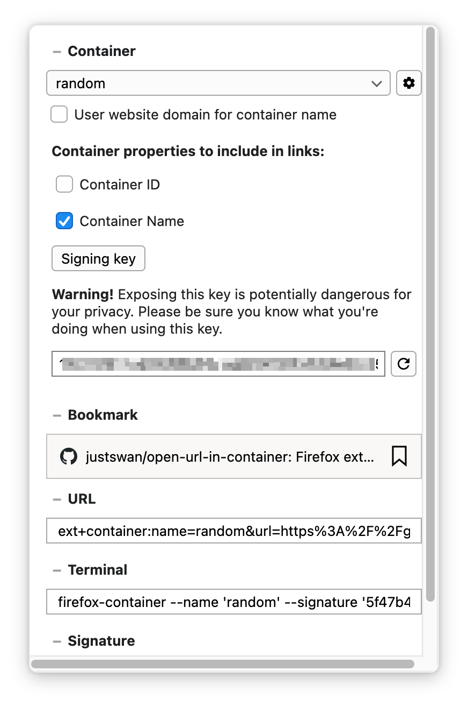

# Open external links in a container


_This is a fork of [honsiorovskyi/open-url-in-container](https://github.com/honsiorovskyi/open-url-in-container) with a pre-built `.xpi`, a working launcher script, and documentation on how to find the signing key._

_**Important:** this code corresponds to an early preview of the future 2.x.x branch. The AMO-published version (1.0.3) does **not** include the signing feature. See [Releases](https://github.com/justswan/open-url-in-container/releases) for a pre-built `.xpi`._

This is a Firefox extension that enables support for opening links in specific containers using custom protocol handler.
It works for terminal, OS shortcuts, bookmarks, password managers, regular HTML pages and many other things.

Also it features a small popup that can be called from the icon in the address bar
which provides a way to get the links or terminal commands for opening current page
in any available container.


## Installation

Requires **Firefox Nightly** or **Developer Edition**:

1. Download the `.xpi` from [Releases](https://github.com/justswan/open-url-in-container/releases)
2. In Firefox, go to `about:config` and set `xpinstall.signatures.required` to `false`
3. Go to `about:addons` → ⚙ → **"Install Add-on From File..."** → select the `.xpi`

## Features

- provides custom protocol handler to open URLs in containers
- provides a UI to generate links, bookmarks and terminal commands
- supports both command line and internal invocations
- supports creation of containers on the fly
- supports setting colors and icons when creating new containers
- supports tabs pinning
- supports opening tabs in reader mode
- works well in combination with other extensions

## Finding the signing key

The signing key is hidden in the extension popup behind a couple of clicks. Here's how to find it:

**Step 1.** Click the extension icon in the address bar, then click the **gear icon** (⚙) next to the container dropdown:



**Step 2.** Click the **"Signing key"** button:



**Step 3.** The key is displayed in the text field. Copy it — you'll need it for the launcher script or your own integrations:



## Examples

Open `https://mozilla.org` in a container named `MyContainer`.

```bash
$ firefox 'ext+container:name=MyContainer&url=https://mozilla.org&signature=ea7214f675398e93764ba44504070221633b0d5dce6c4263715f1cca89ab5f86'
```

Open `https://mozilla.org` in a container named `MyContainer`. If the container doesn't exist, create it using an `orange` colored `fruit` icon. Also, pin the tab.

```bash
$ firefox 'ext+container:name=MyContainer&color=orange&icon=fruit&url=https://mozilla.org&pinned=true&signature=ea7214f675398e93764ba44504070221633b0d5dce6c4263715f1cca89ab5f86'
```

Also it will work with the [links on the site](ext+container:name=MyContainer&url=https://mozilla.org):

```html
<a href="ext+container:name=MyContainer&url=https://mozilla.org&signature=ea7214f675398e93764ba44504070221633b0d5dce6c4263715f1cca89ab5f86">Mozilla.Org in MyContainer</a>
```

### What is signature?

Signature is a simple cryptographic signature (HMAC-SHA256) of the URL parameters passed to the extension.

It protects you from clickjacking attacks where someone could force you to open a malicious URL in one of your private containers, potentially correlating your identity across containers.

- **Without signature**: the extension shows a confirmation dialog asking if you really want to open the link.
- **With valid signature**: the link opens automatically, since only you know the signing key.

## Launcher

The `bin/launcher.py` script provides a command-line way to open URLs in containers with automatic signature generation.

```
Usage: launcher.py [-h] -n NAME [-p] url

Open URL in a Firefox container with signature.

positional arguments:
  url                   URL to open

options:
  -n NAME, --name NAME  Container name
  -p, --print           Print a bookmark URL instead of opening Firefox
```

### Setup

```bash
# Set your signing key (see "Finding the signing key" above)
export OPEN_URL_IN_CONTAINER_SIGNING_KEY="your-hex-key-here"
```

### Opening a URL in a container

```bash
$ ./bin/launcher.py --name Work https://example.com
```

### Generating a bookmark URL

Firefox shows a protocol confirmation dialog when clicking `ext+container:` bookmarks.
The `--print` flag generates a `moz-extension://` URL that bypasses this dialog:

```bash
$ ./bin/launcher.py --name Work --print https://example.com
```

Copy the output and paste it as the URL of a Firefox bookmark.

**Note:** the `--print` output contains your Firefox profile's extension UUID (see setup below).

### Configuration

The script uses two environment variables:

| Variable | Description |
|---|---|
| `OPEN_URL_IN_CONTAINER_SIGNING_KEY` | **(required)** Your signing key (hex string from the extension popup) |
| `OPEN_URL_IN_CONTAINER_EXT_UUID` | Extension internal UUID, required for `--print`. Find it in `about:debugging` → Extensions → Internal UUID |

On macOS, set `FIREFOX_BUNDLE_ID` to override the default (`org.mozilla.nightly`).

## Build

### Step 1: Install node, npm
### Step 2:
```bash
$ git clone https://github.com/justswan/open-url-in-container.git

$ cd open-url-in-container/build

$ npm install

$ npx web-ext build --overwrite-dest --source-dir ../src --ignore-files ../src/tests
```

## License

[Mozilla Public License Version 2.0](LICENSE)

## Contributions

Contributions are very welcome. There's no specific process right now, just open your PRs/issues in this repo.
